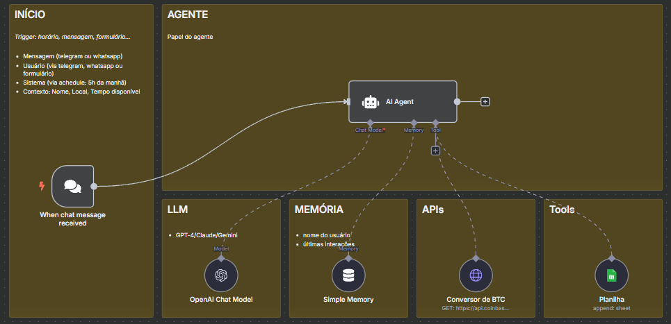

# Modelo que será criado




# Checklist atualizado: Como construir um Agente de IA com ChatGPT + n8n + Planilhas

Este checklist foi criado para desmistificar o uso de agentes de IA e te ajudar a montar o seu do zero — mesmo sem experiência com código. Vamos usar o n8n, Google Sheets e um caso real de conversão de Bitcoin para montar um assistente inteligente que registra suas despesas.

## 1. Entenda o que é um agente de IA

Não é uma automação tradicional. Vai além de regras fixas.

Um agente de IA pode:

* Raciocinar

* Planejar

* Agir com base no contexto

Componentes principais:

🧠 Cérebro

🧾 Memória

🔧 Ferramentas

## 2. Defina o escopo do seu agente

Antes de começar, responda essas perguntas:

* Qual o papel do agente?

* Que tarefa ele precisa resolver?

* Quais dados ele vai acessar?

* Quais ferramentas ele vai usar?

* Como será o formato da resposta?

Nosso exemplo será:

Um assistente de contas que recebe mensagens como “Gastei 50 reais com pizza ontem” e salva esses dados em uma planilha — inclusive fazendo a conversão se o valor estiver em Bitcoin.

## 3. Crie o fluxo no n8n

Abra o n8n, clique em “New Workflow” e adicione o gatilho de entrada:

Use o nó: When Chat Message Received

Ele será o input principal do usuário.
A vantagem é que depois é fácil migrar esse fluxo para Telegram ou WhatsApp. E enquanto isso, temos uma interface de chat pronta no próprio n8n.

## 4. Adicione o nó AI Agent

Esse será o cérebro do nosso agente.

Vamos usar o padrão, mas existem nós específicos.

### Information Extractor

Esse nó é usado para extrair informações estruturadas de um texto com ajuda de um modelo de linguagem (LLM).

#### Exemplo prático:

Você escreve: “Comprei um notebook da Dell por R$ 4500 ontem.”

E define que quer extrair: Produto, Preço, Data

Ele é ideal para automatizar preenchimento de formulários ou transformar texto solto em dados organizados.

### Sentiment Analysis

Esse nó serve para analisar o sentimento de uma mensagem: se é positivo, negativo ou neutro.

#### Exemplo prático:

Você escreve: “Estou muito feliz com o atendimento.”

Ele responde:

```bash
{
"sentiment": "positive",
"confidence": 0.93
}
```

Muito usado para analisar feedbacks de clientes, e-mails ou interações em redes sociais.

### Comparando com o AI Agent:

Information Extractor e Sentiment Analysis são focados em tarefas únicas.

AI Agent é multi-tarefa: pode raciocinar, escolher ferramentas e agir em etapas.

Mas AI Agent é o mais poderoso, pois permite planejar e usar ferramentas autônoma.

### Todo AI Agent precisa de:

🔑 Um modelo (LLM como GPT-4o-mini)

🧠 Uma memória (como Simple Memory)

🔧 Ferramentas (como Google Sheets ou HTTP Request)

## 5. Configure o modelo de linguagem (LLM)

Mostre que o n8n aceita vários modelos:

* OpenAI (ChatGPT, GPT-4o, etc)

* Groq

* Ollama (para rodar no seu computador)

Vamos criar as conexões: com a OpenA.

Explique que mesmo parecendo técnico, é só copiar uma senha. O n8n cuida do resto..

### Exemplo:

Tipo: OpenAI Chat Model

Modelo sugerido: gpt-4o-mini (ótimo custo-benefício)

### Onde gerar a API Key:

Acesse:

## System Message (Mensagem de sistema)

Serve para definir quem o agente é, o que ele pode ou não fazer, estilo de resposta e o contexto inicial. Essa mensagem é invisível ao usuário final, mas molda todo o comportamento do LLM.

### Exemplo pronto para copiar:

Você é um agente de IA autônomo, criado para atuar como um assistente financeiro digital.

Apenas registre despesas. Não responda perguntas fora deste escopo.

Se for questionado sobre assuntos como clima, esportes ou política, diga gentilmente que só pode ajudar com registro de gastos.

## 6. Configure a memória

Para permitir uma conversa contínua com o agente (ou seja, ele lembrar do que o usuário já disse em interações anteriores), é importante adicionar um nó de memória. A opção mais simples e adequada para iniciantes é usar o nó Simple Memory.

Arraste para o editor o nó Simple Memory (está na seção de AI possivelmente). Conecte-o ao nó AI Agent como um sub-nó de memória (no n8n, o AI Agent aceita conexões de diferentes tipos: ferramentas, memória, etc. Certifique-se de conectar o Simple Memory especificamente na porta de Memória do agente – geralmente o editor indica isso com um ícone ou cor diferente).

Configure o Simple Memory definindo a quantidade de interações que ele guarda. Por padrão, ele pode guardar um certo número de mensagens recentes (ex: últimas 5 ou 10 mensagens) Para o caso de uso de despesas, um histórico curto já basta, pois não teremos diálogos extensos. Você pode deixar padrão ou ajustar para, digamos, armazenar as últimas ~5 interações do usuário e agente.

Memória permite que em vez de cada pergunta começar “do zero”, o agente tenha contexto. Por exemplo, se o usuário primeiro diz “Comprei pizza ontem por 50 reais” e depois pergunta “e também gastei 30 no cinema hoje”, o agente com memória pode entender que é a mesma conversa de despesas e até referenciar entradas anteriores se necessário. Sem memória, a segunda frase seria interpretada isoladamente, o que poderia ser problemático se o agente precisasse de contexto. Segundo a documentação, “a memória guarda o histórico de mensagens anteriores, permitindo uma conversa contínua em vez de cada interação começar do zero”

Dica prática: Mostre rapidamente a diferença com um pequeno experimento: execute o agente sem memória e faça duas perguntas encadeadas, depois repita com memória, para evidenciar a mudança. (Exemplo: sem memória, pergunte algo em duas partes – na segunda parte o agente provavelmente não “lembra” da primeira; com memória ele lembra. Isso pode ser demonstrado se o tempo permitir, mas como a aula é curta, ao menos conceitualmente mencione.)

“Me chamo Luciano”

“Qual é o meu nome?”

## 7. Conecte as ferramentas

### Google Sheets

Adicione o nó Google Sheets Tool

Operação: Append Row

Campos sugeridos: Item, Valor, Fornecedor, Tipo de Despesa, Data

Use $fromAI("campo") nos inputs para deixar que o agente preencha automaticamente.

### 🌐 HTTP Request (para conversão de BTC)

URL: https://api.coinbase.com/v2/prices/BTC-BRL/spot

Método: GET

Conecte esse nó como Tool do AI Agent. Ele vai consultar o preço do Bitcoin sempre que necessário.

Teste simples:
 Envie: “Gastei 0.0009 BTC com pizza ontem.”
 O agente deve converter o valor antes de registrar.

## 8. Configure o System Message do agente

## Prompt interno (Prompt do agente / “Role + Task + Tools + Constraints + Output”)

### Exemplo pronto:

[Role]

Você é um assistente de finanças pessoais. Seu único objetivo é registrar despesas informadas pelo usuário.

[Task]

1. Receba a mensagem do usuário contendo um gasto.

2. Identifique e extraia:

- Data do gasto (DD/MM/AAAA)

- Descrição do item

- Valor

- Moeda (BRL)

- Nome do fornecedor

- Tipo de despesa (pessoal ou empresarial)

3. Se a moeda for BTC (Bitcoin), use a ferramenta de conversão antes de registrar o valor em BRL.

4. Use a ferramenta de planilha para registrar os dados.

[Tools]

- Conversor de BTC: Retorna o valor atual de 1 BTC em BRL.

- Planilha: Campos necessários — Data, Item, Valor (em BRL), Fornecedor, Tipo de Despesa.

[Constraints]

- Não responda nada fora do escopo de controle de despesas.

- Se for questionado sobre outro assunto, diga: “Sou um assistente de controle financeiro e só posso registrar despesas.”

- Nunca forneça respostas aleatórias.

- Use a data atual como referência se o usuário não especificar.

[Output]

Após salvar, responda de forma curta e clara:

"Despesa registrada: [Item] – R$[valor convertido] em [data]."

Exemplo de resposta:

"Despesa registrada: Pizza – R$52,30 em 17/06/2025."

## 10. Teste e publique

## Testando o Agente e Exemplos de Prompts

Com tudo configurado (fluxo montado, parâmetros ajustados, instruções definidas), vamos testar! Como o tempo de aula é curto, tenha já alguns casos de teste preparados para demonstrar diferentes funcionalidades:

Caso base (despesa em BRL): “Comprei pizza ontem por 50 reais na Dominos.” – Execute o fluxo com essa entrada. Esperado: o agente reconhece "ontem" (17/06/2025, se hoje é 18/06), valor 50 BRL, descrição "pizza na Dominos", e deve não precisar usar a API (pois já está em reais). Ele então adiciona ao Sheets (via ferramenta) e responde algo como “Despesa registrada: pizza Dominos – R$50 (17/06/2025).” Verifique no Google Sheets se a linha foi adicionada corretamente. Mostre na interface do n8n o log: deve aparecer que ele usou a ferramenta Google Sheets com os campos preenchidos (graças ao $fromAI). Como ativamos Return Intermediate Steps, possivelmente a saída do nó AI Agent mostrará um objeto JSON com uma propriedade listing steps/tools usadas – use isso para ilustrar: “Olha, ele seguiu direto para o Sheets e pulou a conversão, pois detectou que era reais.”

Caso conversão BTC: “Comprei pizza ontem por 0.0009 BTC na Dominos.” – Aqui o agente deve identificar valor em BTC e acionar duas ferramentas: primeiro o HTTP (para pegar cotação), depois o Sheets. Rode o fluxo. No output intermediário, deve mostrar algo como: Step1: HTTP Request chamado, retornou preço (ex: 1 BTC = R$200000, por exemplo), Step2: Sheets chamado com valor calculado (R$180, se 0.0009 * 200000). Veja se a resposta ao usuário menciona corretamente o valor convertido, ex: “Despesa registrada: pizza Dominos – R$180 (17/06/2025).” (O valor exato dependerá da cotação ao vivo – confira se faz sentido). Esse exemplo demonstra a capacidade do agente usar ferramentas em sequência. Reforce como no log vemos o agente pensando: “Valor em BTC detectado, usando API...” etc. Isso dá um “ufa!” didático – o aluno vê que não teve mágica, o agente de fato buscou a informação.

Exemplo de System Message personalizado: Para mostrar o impacto do system message, você pode temporariamente alterar alguma instrução nele e testar. Por exemplo, acrescente no system message “Responda sempre com uma frase engraçada no final.” (ou algo evidente) e rode um exemplo de novo – o agente possivelmente vai obedecer e adicionar humor. Depois retire, explicando que não faremos isso no produto final, era só para demonstrar. Isso evidencia como o comportamento pode ser guiado pela system message. Outra ideia: mude a língua no system message (diga “responda em inglês”) e refaça o teste – o agente deve então responder em inglês. Isso confirma a utilidade dessas instruções ocultas.

Testando max iterations: Provoque o agente a realizar várias iterações. Um prompt sugerido foi “Me diga o valor do BTC em reais 3 vezes seguidas.” – Aqui o usuário está pedindo para repetir a conversão 3 vezes. Se rodar isso, veja como o agente procede. Com Max Iterations = 10 (padrão), ele poderia teoricamente chamar a API 3 vezes ou entrar num loop. Porém, mais provável é que o LLM interprete a solicitação e tente cumprir repetindo na resposta. Talvez ele chame a API uma vez e simplesmente repita o valor três vezes. Agora, se ajustarmos Max Iterations = 2, pode ser que o agente não consiga “pensar” em repetir tantas vezes ou pare antes. Observe e discuta: “Por que será que com menos iterações ele parou?” – Leve os alunos a entender que limitar iterações pode impedir loops longos ou gastos excessivos de token, mas também pode truncar uma tarefa complexa. Obs: Este prompt é meio artificial; você também poderia testar algo como “Qual a cotação do BTC? E de novo? E mais uma vez?” em sequência para forçar interações. O importante é ilustrar o efeito do parâmetro.

Verificando memória em múltiplas interações: Faça um teste contínuo: primeiro, “Gastei 100 reais no supermercado.” (agente registra). Em seguida, sem resetar o chat, pergunte “E ontem no restaurante, 200.” – Note que aqui o usuário na segunda frase não repetiu o verbo nem contexto claramente, confiando que o agente lembre que estamos falando de gastos. Com a memória ligada, o agente deve interpretar que “200 no restaurante ontem” é mais uma despesa e registrá-la, possivelmente confirmando “Despesa registrada: restaurante – R$200 (17/06/2025).”. Se a memória estivesse desligada, ele talvez ficasse confuso ou perguntasse “o que você quer dizer?”. Após registrar duas ou mais despesas, pergunte algo contextual como “Quais despesas já cadastrei?”. Nosso agente não foi programado para somar ou listar (até porque o Sheets Append não retorna dados ao agente), então ele pode tentar responder apenas com base na memória das últimas interações. Provavelmente ele repetirá as últimas despesas mencionadas (porque estão na memória). Isso mostra na prática a utilidade (e limite) da memória simples – ele lembra do chat, mas não tem conhecimento direto da planilha a não ser que a gente crie uma ferramenta para ler de lá, o que não fizemos. Deixe claro: se precisássemos que o agente somasse valores, teríamos que dar outra ferramenta (ex: um Google Sheets Read ou mantido total em memória). Essa extensão fica como ideia futura.

Comportamento fora de escopo: Embora não seja o foco, vale testar rapidamente: “Quem ganhou o jogo ontem?” – O agente, seguindo nossas restrições, deve recusar ou redirecionar, por exemplo dizendo: “Desculpe, só posso ajudar com despesas financeiras.” Se ele fizer isso corretamente, aplauda a configuração de escopo bem sucedida 😄 (foi graças às instruções do system e prompt). Se por acaso ele tentar responder ou alucinar, então temos um ponto de melhoria – talvez reforçar ainda mais o escopo nas instruções.